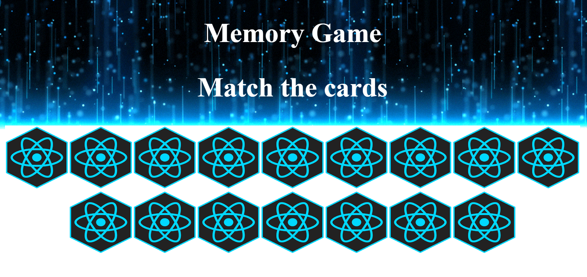

### Overview:

This is a memory game using react. It will randomly change the spots where the images load, and you will need to remember where the images are in order to match with the correct techonology. This application was deployed in netlify..

URL: https://kind-clarke-4e206c.netlify.com/

### Techonologies used:

-JSX
-React
-CSS

`npm dependencies`:
"prop-types": "^15.7.2",
"react": "^16.8.6",
"react-dom": "^16.8.6",
"react-scripts": "3.0.1"

### Clone or download

In the command line if needed:

`npm i` to install depencies.

`npm start` to run the project locally.

Runs the app in the development mode. 
Open [http://localhost:3000](http://localhost:3000) to view it in the browser.
